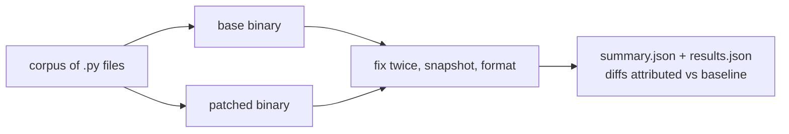

<div align="center">

# 🔬 ruff-difftest

**Differential testing for ruff builds — catch what the test suite structurally can't.**

[](https://www.python.org)
[](#requirements)
[](https://docs.astral.sh/uv/)
[](LICENSE)

**On its first real run — 74 fixture files — it found a convergence bug that
passes all 2,836 tests in ruff's own suite.**
[Read the write-up](findings/2026-10-05-e302-indented-comment-nonconvergence.md)
·
[6-line repro](repro/case_indented_comment.py)

</div>

---

## Why

Snapshot tests apply a fix **once**. Convergence bugs live in the **twice** —
when two rules' autofixes undo each other, `--fix` never settles, and unit
tests never see it.

And raw disagreement counts between two builds are meaningless on their own.
You need to know which disagreements the *base* build produces identically.
This harness runs the full `check --fix` pipeline with both binaries — twice
per build — and does the baseline attribution for you.

## What it checks

| Check | Question it answers |
|---|---|
| **Convergence** | Does every file survive `--fix` without `Failed to converge after N iterations`? |
| **Idempotence** | Is a second `--fix` a no-op on the first one's output? |
| **Behavior drift** | Does the patched build's final output differ from base anywhere? |
| **Attribution** | For every drift: does `check --fix` → `format` disagree in base too (pre-existing), or only in patched (candidate regression)? |

## How it works



Every file runs in a fresh temp copy per build, so one build's output can
never contaminate the other's run. Files are processed in parallel
(`--jobs` controls the worker count).

## Quickstart

```bash
# 1. Build the two binaries you want to compare
cargo build --bin ruff                    # on each checkout
cp target/debug/ruff /tmp/ruff_base       # from the unpatched commit
cp target/debug/ruff /tmp/ruff_fixed      # from your branch

# 2. Collect a corpus — ruff's own fixtures, a CPython checkout, your codebase…
uv run ruff_difftest.py collect --out /tmp/corpus \
    --roots /path/to/ruff/crates/ruff_linter/resources/test/fixtures \
    --max-per-root 3000

# 3. Compare
uv run ruff_difftest.py run --corpus /tmp/corpus \
    --base /tmp/ruff_base --fixed /tmp/ruff_fixed \
    --select E301,E302,E303,E304,E305,E306,I001 \
    --jobs 8 --report /tmp/difftest-report
```

That's the whole tool: one PEP 723 script, zero third-party dependencies.
`uv run` takes care of everything else.

## Example output

Literal output of the first real run (74 pycodestyle fixtures, unpatched
ruff `8b83731` vs a patched E302 build):

```text
corpus: 74 files; select=E301,E302,E303,E304,E305,E306,I001
  74/74 checked
== summary ==
converge failures: base=1 fixed=1
non-idempotent:    base=0 fixed=0
differing files:   2
  formatter disagrees in both builds (pre-existing): 2
  formatter disagrees only in patched (regression?): 0
errors: 0
```

Both builds failed to converge **once each — on different files**:

- `E30_comment_before_definition.py` — **base only**. The bug the patch
  exists to fix, caught exactly as intended.
- `E30.py` — **patched only**. A regression that no unit test in the patched
  tree catches: all 2,836 pass there. Minimized to six lines —
  [full write-up](findings/2026-10-05-e302-indented-comment-nonconvergence.md).

> [!IMPORTANT]
> Symmetric-looking summaries hide asymmetric facts. `base=1 fixed=1` reads
> like "nothing changed" until you attribute *which* file each failure
> belongs to. Always attribute before reporting.

## The find, in one file

```python
def test_update():
    pass

    # comment
def test_clientmodel():
    pass
```

Unpatched: converges in one pass. Patched: E302 anchors its insertion at the
comment's start, placing two blank lines *inside* `test_update`'s body; E303
then removes them; the two rules fight for 100 iterations and never settle —
while the entire test suite stays green.

[Details, mechanism, and candidate refinements →](findings/2026-10-05-e302-indented-comment-nonconvergence.md)

## Requirements

- Python 3.10+ and [uv](https://docs.astral.sh/uv/) — or run the script with
  any interpreter; it is stdlib-only
- Two ruff binaries to compare

## Notes

- The per-run `ruff.toml` is written with `preview = true`, because
  blank-line behavior differs under preview. Edit `mode_run` for other config.
- The formatter comparison runs with the same binary that did the fixing,
  per build.
- The report directory receives `summary.json` (counts) and `results.json`
  (one entry per interesting file, with per-build flags for convergence,
  idempotence, output difference, and formatter disagreement).

## License

[MIT](LICENSE)
